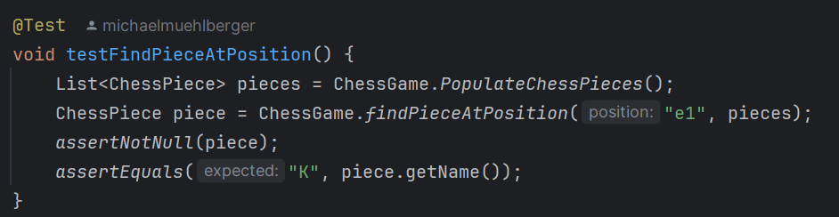

# TechDemo: Continuous Delivery 

## Checklist
For a detailed list of tasks and goals, refer to the [Checkliste](./CHECKLIST.md). This document serves as a guide to ensure all relevant CD aspects are integrated into this demo.

## Table of Contents
1. [Introduction](#introduction)
1. [Uebungen](#uebungen)
2. [Unit Tests](#unit-tests)
3. [Containerisierung](#containerisierung)
4. [Workflows](#workflows)

## Introduction
In der TechDemo wurde ein Continuous Delivery Prozess mittels eines ChessClient (Java Maven Projekts) durchgeführt. 
Dabei wurden Schritte automatisiert. Unit Tests ausgeführt, und mittels GitHub Actions eine CI Pipline definiert, welche das Projekt in einer isolierten Umgebung (Docker Container) buildet und testet.

## Repository mit Übungen
https://github.com/michaawl/continuous_delivery_uebungen

## Plugins

In der Konfigruationsdatei des Maven Projektes (pom.xml) wurden folgende Pugins hinzugefügt.
Bei einem Push in den main branch wird ein Workflow ausgeführt der folgende Commands ausführt und die jeweilige Report Files in den Artifakten hochlädt.

 ### JUnit

 ### jacoco
 `mvn clean test jacoco:report`

 Dieser Befehl erzeugt eine Ausgabe in target/site/jacoco/index.html

 ### checkstyle
 `mvn checkstyle:check`

 Dieser Befehl erzeugt eine Ausgabe in target/checkstyle-checker.xml
 
 ### surefire
 `mvn surefire-report:report`

 Dieser Befehl erzeugt eine Ausgabe der Testberichte und speichert sie in target/site/surefire-report.html

## Unit tests

In der ChessGameTest Klasse wurden UnitTests hinzugefügt, welche Methoden der ChessGame Klassen testen.

## Containerisierung

### MySQL Server

Docker wurde verwendet um einerseits eine isolierten SQL mittels einer .env Datei Server zu starten.
In der .env Datei sind nur TEMPLATE werte und müssen dementsprechend angepasst werden.
In dem Container wird außerdem mit dem [Docker Compose](docker-compose-setup-mysql.yml) ein Create Script ausgeführt:
[Create Script](schema.sql). 

Der Container kann wie folgt gestartet werden:

`docker-compose -f docker-compose-setup-mysql.yml up
`

(
   
   Bei Problemen:

   `docker-compose -f docker-compose-setup-mysql.yml down -v`
   `docker-compose -f docker-compose-setup-mysql.yml up --build`

)

Um zu sehen ob es funktioniert hat die Bash auf Docker ausführen:

`docker exec -it mysql-db bash`

mysql starten, die Datenabank auswählen und die Tables anzeigen lassen:

`USE <database_name>;`

`SHOW TABLES;`

### Docker in CI Pipeline
Außerdem wird ein [Docker Compose](docker-compose-pipeline.yml) in der Build Pipeline gestartet. Hier wird in einer Maven Umgebung das Projekt gebuildet und getestet. Anschließend die Report files auf den Git Server kopiert und gepublished.

### Workflows
Der Workflow ci.yml befindet sich in dem Repository unter .github/workflows

`on:
  push:
    branches:
      - main
  pull_request:
    branches:
      - main

permissions:
  checks: write
  contents: read

jobs:
  build:
    runs-on: ubuntu-latest

    steps:
      - name: Checkout code
        uses: actions/checkout@v4

      - name: Set up Docker Compose
        run: sudo apt-get update && sudo apt-get install -y docker-compose

      - name: Build and Test in Docker
        run: |
          docker-compose -f docker-compose-pipeline.yml up --abort-on-container-exit
          docker cp maven_build:/workspace/target/surefire-reports ./test-results
          docker cp maven_build:/workspace/target/checkstyle-checker.xml ./checkstyle-report.xml || true
          docker cp maven_build:/workspace/target/gRPCClient-1.0-SNAPSHOT.jar ./chessClient.jar || true

      - name: Upload Test Results
        uses: actions/upload-artifact@v4
        with:
          name: test-results
          path: test-results/*.xml

      - name: Publish Test Report
        uses: mikepenz/action-junit-report@v4
        if: always()
        with:
          report_paths: '**/test-results/*.xml'
          require_tests: true
          fail_on_failure: false
          include_passed: true

      - name: Upload Checkstyle Report
        uses: actions/upload-artifact@v4
        with:
          name: checkstyle-report
          path: checkstyle-report.xml

      - name: Upload Build Artifact
        uses: actions/upload-artifact@v4
        with:
          name: chessClient-artifact
          path: chessClient.jar`

Dabei wird zuerst Docker Compose auf dem Pipeline Server von Git installiert und anschließend das Docker Compose gestartet, welches das Projekt in Container buildet und testet. 

Anschließend werden die Artefakte aus dem Container wieder in die Git Umgebung veschoben und anschließend unter den Artefakten deployed.