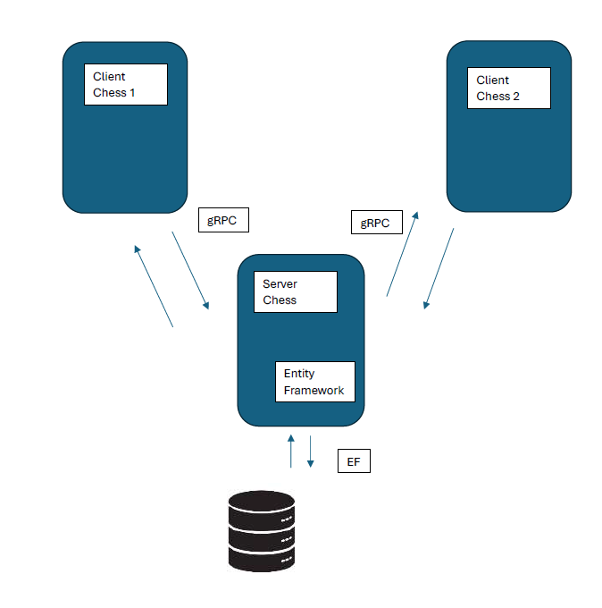
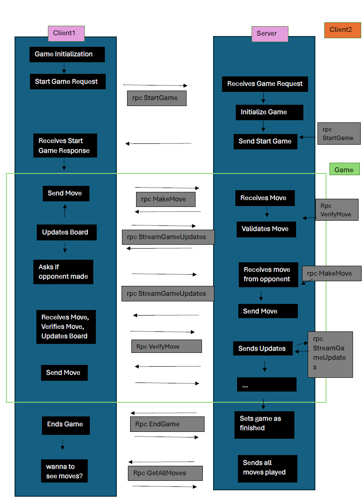
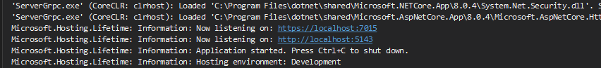
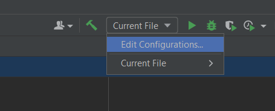
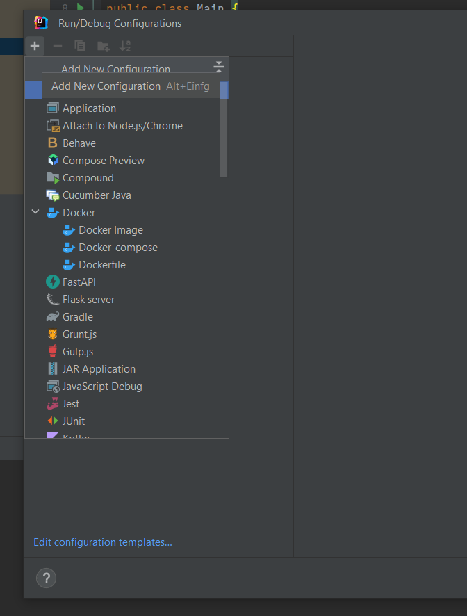
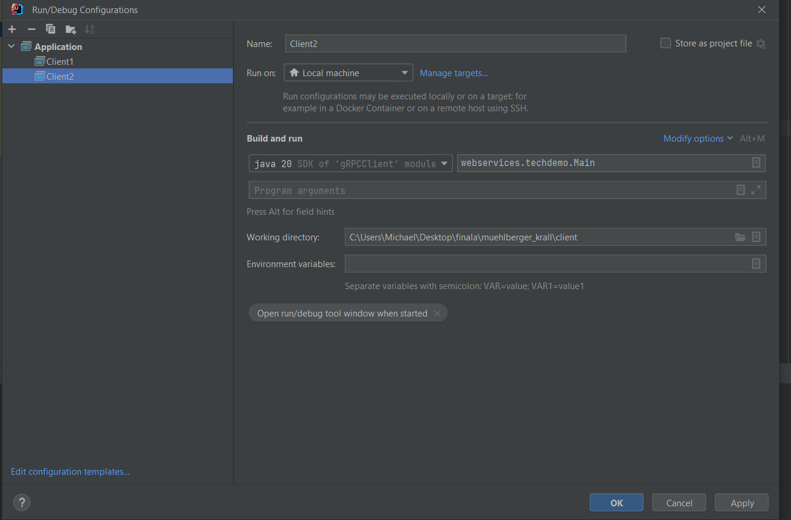
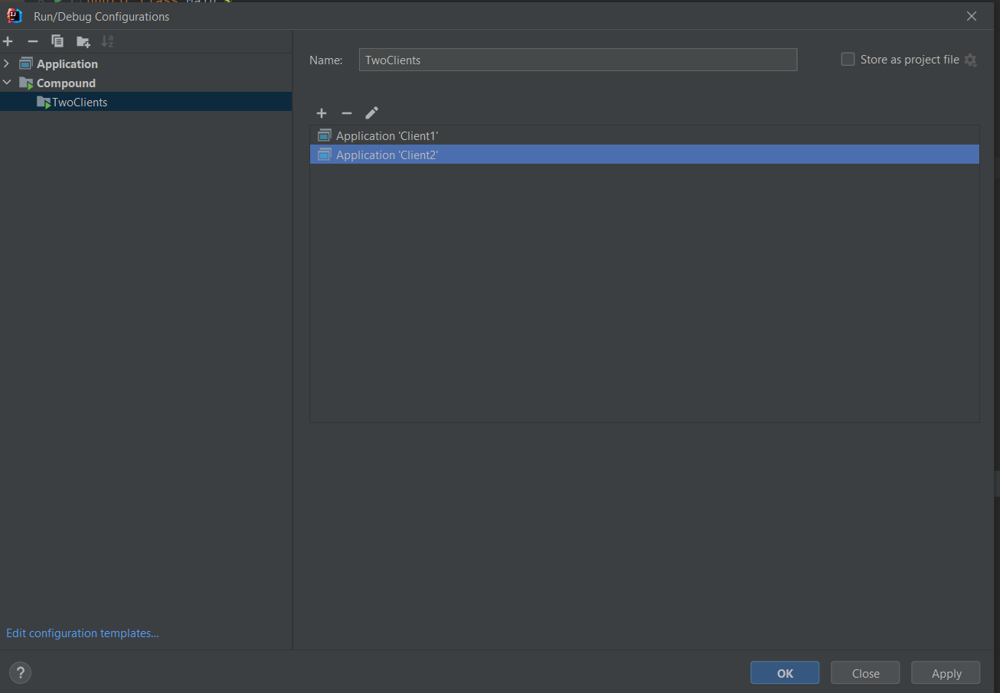
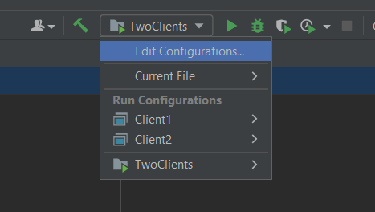
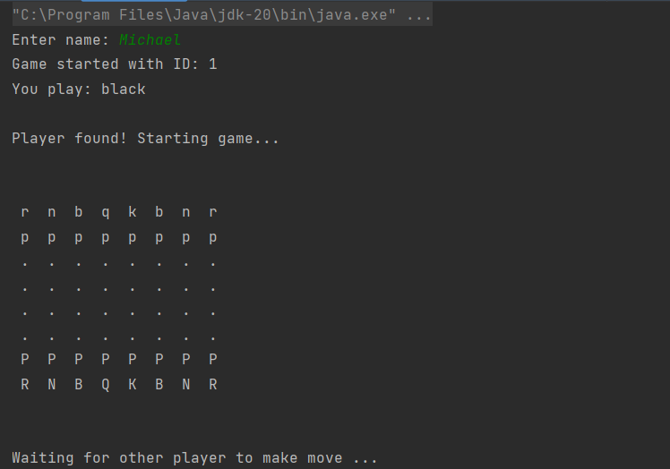

# ChessEF - Ein Schach Projekt mit Hilfe von gRPC und des Entity Frameworks

**Mühlberger Michael**  
**Krall David**

---
## Architektur

### Grundlegender Aufbau
Der erstellte Service funktioniert mittels eines Schach C#-Server Services der mittels Entity Framework auf die Datenbank (SqLite) zugreift. 
Die Java-Clients, auf denen die Benutzer Schachspielen können kommunzieren mit dem Server mithilfe von gRPC - Calls. Damit man Schach spielen kann, müssen 2 Clients laufen, der Server verbindet diese dann automatisch. Die Kommunikation mit dem Server findet mittels polling statt (regelmäßige Abgrafen vom Client, ob sich der Zustand des Spielt geändert hat).

### Flow-Chart 

[Dokumentation](./doc/documentation.pdf)

---

## Intallation: Servers ( C# )
1. `setup_server.cmd`ausführen, um Projektabhängigkeiten zu installieren
2. `ServerGrpc.sln` in Visual Studio öffnen und `https` starten
3. Der Server sollte nun laufen mit https://localhost:7015 und http://localhost:5143 erreichbar sein.

Output:

## Intallation: Client ( Java )

1. `setup_client.cmd` ausführen, um Projektabhängigkeiten zu installieren
2. 2 Clients mit Hilfe der `client\src\main\java\webservices\techdemo\Main.java` starten (z.B. in VS Code oder IntelliJ)

    Erstellen von 2 Clients mit IntelliJ:
    - Edit Configuration auswählen
    

    - Auf "+" dürcken und bei "Add New Configuration" Application auswählen.
    

    - Namen eingeben und Main Class auswählen. Anschließend eine weitere Application erstellen (z.B. Client 2) und die selben Schritte durchführe.
    

    - Nun bei "+" Add New Configuration "Compound" auswählen, hier können nun die beiden Clients mit dem "+" im Untermenü die 2 Applications hinzugefügt werden.

    

    - Nun kann im Konfiguation Menü das erstellte Compound ausgewählt werden. klickt man nun auf Run, werden 2 Clients ausgeführt.

    

    - Auf Ausführen drücken.

3. Namen auf beiden Clients angeben und zum Server verbinden ( der Server muss laufen um spielen zu können!)
4. das Schachbrett sollte nun zu sehen sein

## Ablauf

* Einarbeitung in Themen (gRPC, Entity Framework) (David, Michael)
* einfache Endpunkte erstellen und CRUD Funktionalität erstellen (Michael)
* Darstellung Spielfeld, Schach Implementierungen (David)

*Ziel:*

Schach mit Hilfe eines Services und Zugriff und Speichern der Daten mit Hilfe der implementierten CRUD Funktionen in gRPC über das Entity Framework.

## Idee

In diesem Projekt soll es darum gehen Schach mit Hilfe des [Entity Frameworks](https://en.wikipedia.org/wiki/Entity_Framework) und gRPC zu implementieren. Ausgangspunkt war, dass bei uns ein großes Interesse an C# besteht und zusätzlich das Entity Framework und gRPC entweder neu ist oder noch zu wenig verwendet wurde. Wir möchten uns im Rahmen dieses Projektes in diese Richtung weiterbilden.

## Tutorials

* [Entity Framework](https://www.entityframeworktutorial.net/)
* <del>[Blazor](https://www.pragimtech.com/blog/blazor/what-is-blazor/)</del>
* [gRPC](https://grpc.io/docs/languages/go/basics/)
  * [Unterschied zwischen gRPC und REST](https://aws.amazon.com/de/compare/the-difference-between-grpc-and-rest/)
* [[YouTube] - gRPC Service with .NET 7](https://www.youtube.com/watch?v=Rqz9XiSqH3E)
* [[YouTube] - Checkers in Blazor](https://www.youtube.com/watch?v=3mybY6ePB-8)
